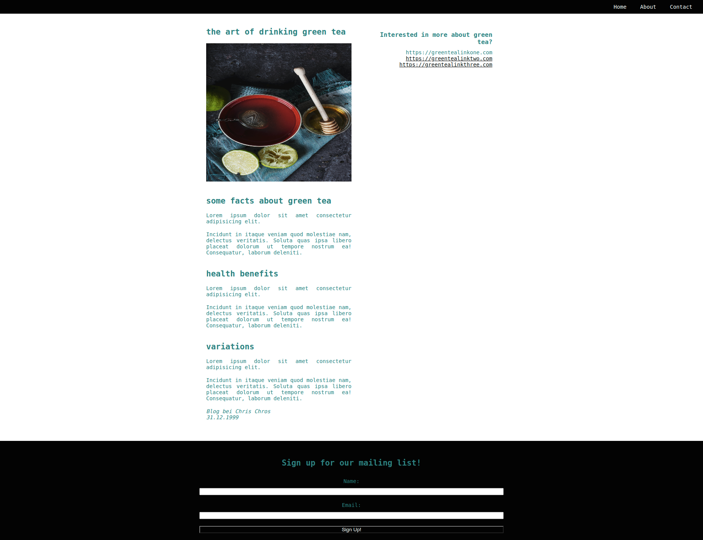
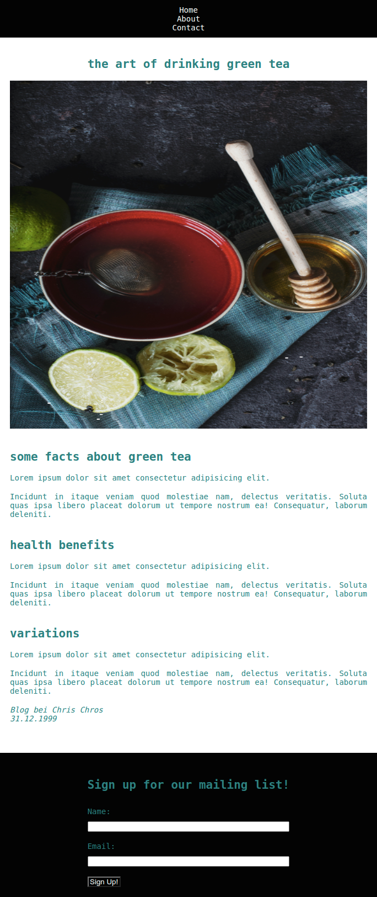
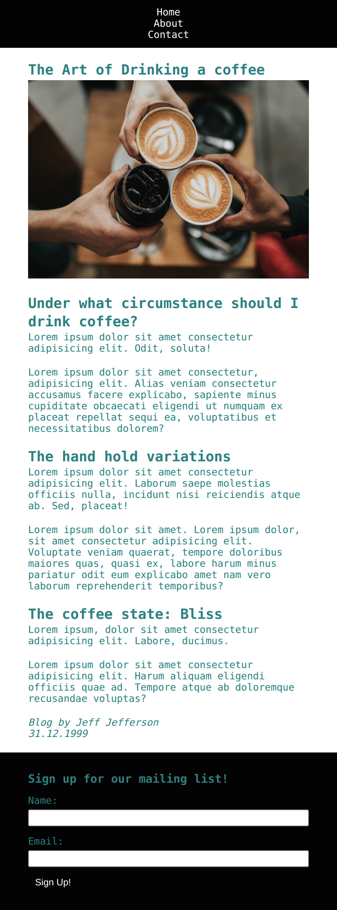
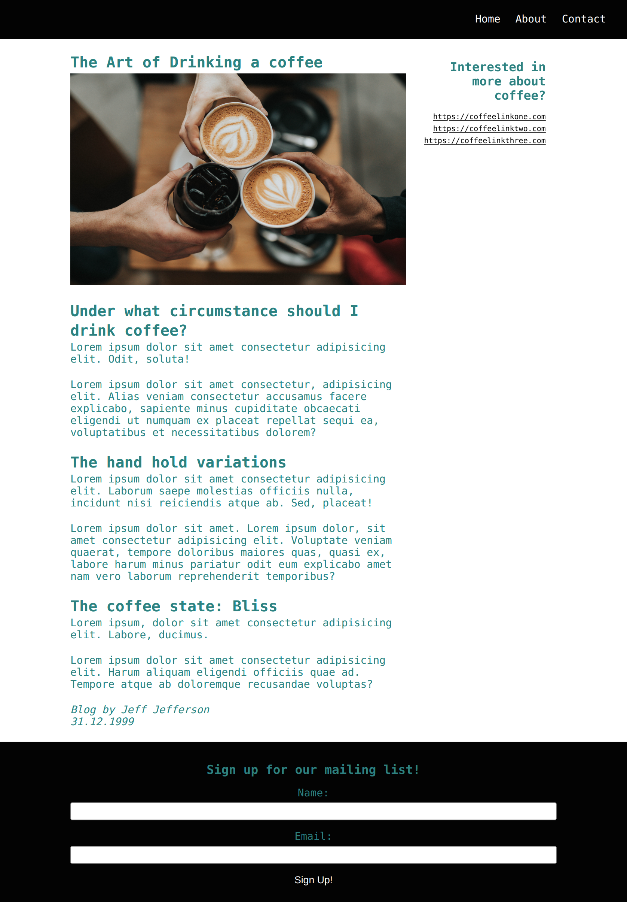

# Responsive blog for tea lovers

## Exercise Course-Module 1 - UserInterfaceBasics (UIB) - HTML/CSS

created at 12.10.22

Created a blog page using media queries for a mobile and desktop view oriented to the mockups below; used `mobile first` technic, classes, sections, css variables and css-display-property to hide sections when switch between views;

### my desktop version:

### my mobile version:

#### Image-Source:

Photo by Gaelle Marcel on "https://unsplash.com/photos/red-ceramic-bowl-filled-with-water-beside-lime-and-honey-9hG-jRmlTm8?utm_content=creditCopyText&utm_medium=referral&utm_source=unsplash"

### Mockups:

- mobile:
  

- desktop:
  
